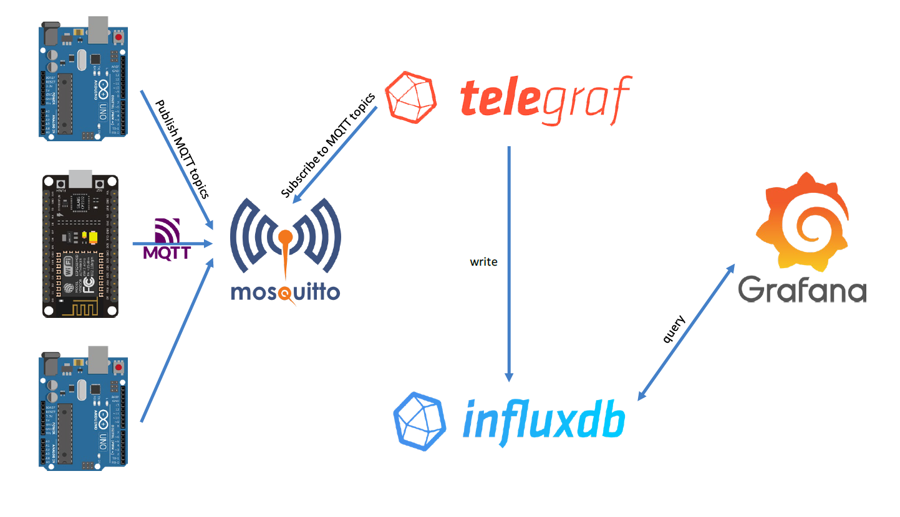
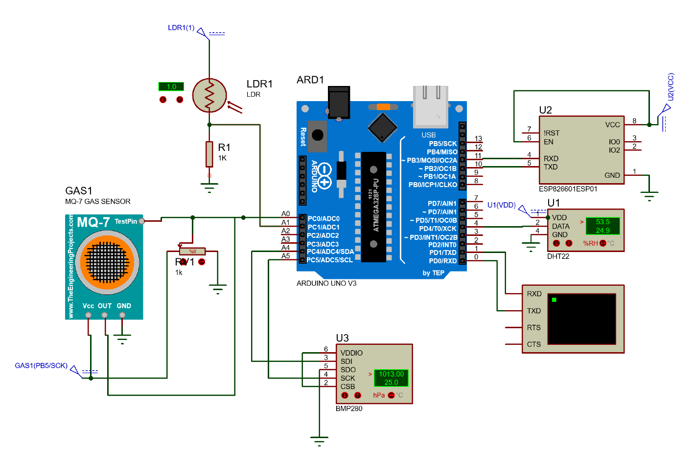
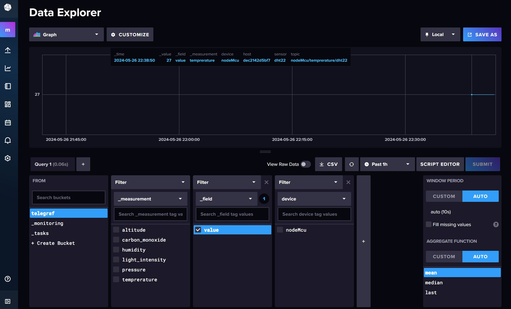
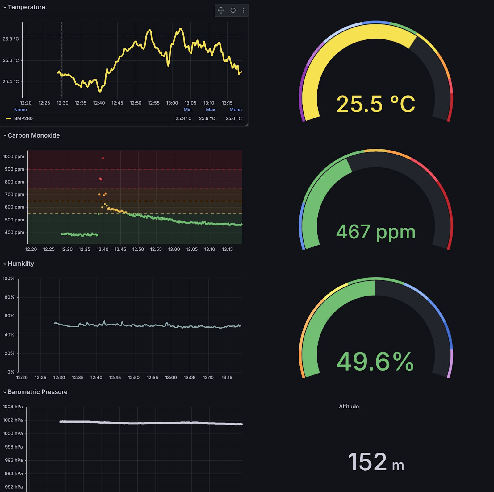

# IoT Weather Station
This project involves building a weather station using an Arduino MCU connected to an ESP8266 module for Wi-Fi capabilities. The weather station gathers environmental data such as temperature, humidity, and atmospheric pressure from various sensors. The collected data is published as MQTT topics and stored in InfluxDB, a time-series database. Finally, the measurements are visualized using Grafana dashboards. The entire stack is containerized using Docker Compose for a streamlined deployment process.


## Features
- **Real-time Data Collection:** Collects data from multiple sensors (e.g. temperature, humidity, pressure).
- **Wireless Connectivity:** Utilizes an ESP8266 module to enable Wi-Fi connectivity.
- **MQTT Protocol:** Sends data as topics to an MQTT broker for reliable communication.
- **Time-Series Data Storage:** Uses InfluxDB to store the sensor readings with timestamped precision.
- **Data Visualization:** Visualizes data using Grafana dashboards.
- **Dockerized Services:** All services (MQTT broker, Telegraf, InfluxDB, and Grafana) are containerized with Docker and managed using Docker Compose for easy deployment.

## Hardware Requirements
- Arduino MCU (e.g., Arduino Uno, Nano)
- ESP8266 Wi-Fi module
- Environmental sensors (e.g. DHT22 for temperature and humidity, BMP280 for pressure, MQ-7 for gas)
- Jumper wires and breadboard
- Power supply or battery pack

## Software Requirements
- Arduino IDE (for programming the MCU)
- Docker and Docker Compose (for deploying services)
- MQTT library for Arduino (e.g., PubSubClient)

## Architecture

1. **Arduino MCU** collects data from sensors and sends it to ESP8266.
2. **ESP8266** acts as the Wi-Fi interface, publishing data to an MQTT broker.
3. **MQTT Broker** receives data and forwards it to Subscribers.
4. **Telegraf** subscribes to MQTT Topics, proccesses, transforms and forwards data to InfluxDB. 
5. **InfluxDB** stores the time-series data.
6. **Grafana** connects to InfluxDB and visualizes the data.




## Setup Instructions
1. **Clone the repository:**
     ```bash
     git clone https://github.com/Vasilis-Thomas/IoT-Weather-Station.git
     cd IoT-Weather-Station
     ```

2. **MCUs Software Configuration:**
    - Open `esp8266Sketch.ino` in the Arduino IDE available in the `./Arduino/sketches/esp8266Sketch` directory.
    - Install the necessary libraries (e.g. PubSubClient, sensor libraries).
    - Modify the Wi-Fi credentials and MQTT broker address in the code.
    - Flash the ESP8266 with the firmware code. 
    - Flash the Arduino with the firmware code available in the `./Arduino/sketches/arduinoSketch` directory.

3.  **MCUs Hardware Configuration:**
    - Connect the sensors to the Arduino board as in the below schematic.
    - Wire the ESP8266 module to the Arduino using the appropriate pins.
    - Power the Arduino.
    

4. **Start the Docker services:**
    - Adjust the environment variables defined in `./Docker/.env` that are used to setup and deploy the stack.
    ```bash
    cd Docker
    docker-compose up -d
    ```
6. **InfluxDB Configuration:**
    - Access InfluxDB at `http://localhost:8086`.

7. **Grafana Configuration**:
   - Access Grafana at `http://localhost:3000` (default credentials: admin/admin).


## MQTT Topics

The following topics are used for MQTT communication:

- `arduino/humidity/dht22`
- `arduino/temprerature/dht22`
- `arduino/temprerature/bmp280`
- `arduino/pressure/bmp280`
- `arduino/altitude/bmp280`
- `arduino/carbon_monoxide/mq7`
- `arduino/light_intensity/ld`

Each topic corresponds to a specific sensor measurement.

## Usage
- Once all the services are up and running, your IoT Weather Station should begin sending data to the MQTT broker.
- Use the Grafana dashboard to monitor real-time data and visualize historical trends.

## Screenshots





## Acknowledgements
- [Mosquitto MQTT](https://mosquitto.org/)
- [InfluxDB](https://www.influxdata.com/main/)
- [Grafana](https://grafana.com/)
- [Docker](https://www.docker.com/)

## Authors
👤 **Θωμάς Βασίλειος**
* GitHub: [@Vasilis-Thomas](https://github.com/Vasilis-Thomas)

👤 **Σαρακενίδης Νικόλαος**
* GitHub: [@Nikoreve](https://github.com/Nikoreve)

